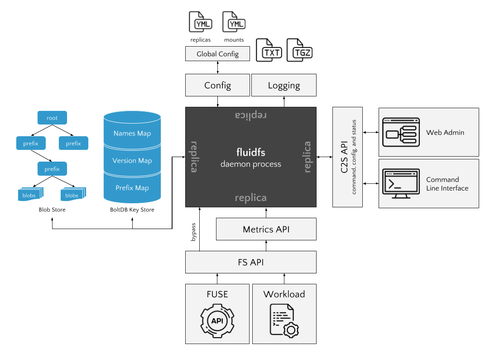

# Architecture

## Replication

FluidFS will have three modes of operation with two primary protocols. The consistency protocols include:

- Basic Raft
- Hierarchical Consensus

And the modes of operation are currently:

- Best Effort
- Transactions
- Linearizeability

The prototype version of FluidFS will implement the Basic Raft/Linearizeability consistency protocol and operation mode. This will allow us to set a performance baseline and to build many of the components required for a distributed file system that is coordinated by consensus.

This mode of operation will be implemented through _locking_ decisions that are determined by consensus. Locks will eventually be replaced by _leases_, which for now we will describe as time limited locks that can be automatically renewed through a heartbeat mechanism.

### Logs and Caches

Each replica will maintain a local _cache_ of version information for fast lookups. This will be implemented as a key-value store where the namespace of the filesystem points to the latest local version of each entity. The replica can retrieve the version meta data by:

- Looking up the latest version for the entity in the cache
- Looking up the most recent commit for the entity in the cache
- Requesting the version for the entity from the leader

In our current mode of operation, a read access will need to lock the file (unless we have read-only accesses) and detect if the file is locked or not.  

Consensus decisions order a log - and all replicas will contain an in-memory log of operations. The log will periodically be snapshotted to disk in order to free memory (we can perform a similar mechanism for the cache). There are open questions about how the cache and the log interact.

### Version Replication

Metadata concerning file system entities are the only objects that need replication in a consistent fashion. When consensus algorithms are used for consistency, they create a single, ordered log that will contain (for our current mode of operation):

- Lock grants
- Version meta data (I propose the log only contain version numbers)
- Lock releases

On a read access (open):

1. Read the latest version from the DB (check if locked, if so abort)
2. Request a lock from the leader (consensus occurs)
3. On lock commit, update metadata and return the file's blobs.

On a write access (close):

- store the blobs and the write metadata into the cache (read your writes)
- forward the remote write to the leader
- if leader is unavailable, keep retrying
- both version decision and lock release occur simultaneously
- if leader rejects the write (e.g. the lock was removed before the write), mark the conflict on the file (similar to the Git method of marking merge conflicts).
- on commit, update the local metadata

### Blob Replication

Smarter blob replication will be required for the future but for now:

- blobs are stored either in BoltDB or prefixed directories on disk
- when blobs are written, they are replicated via anti-entropy
- anti-entropy sessions broadcast a list of prefixes and their blob count
- the remote returns any additional blobs since that count (pull)

This will lead to full replication of all blobs, and further inspection of blob replication in the future is required.

## Configuration

The system will be configured by YAML files, with increasing priority:

- /etc/fluid/fluid.yml
- $HOME/.fluid/fluid.yml
- $PWD/fluid.yml

A YAML configuration can be passed in at the command line (to allow us to conduct multiple experiments), however any command line arguments will supersede any configuration in any YAML file.

I will also create a configuration server that returns a global configuration via JSON API. If the global_config variable is set, then on startup/reload the system will request the global configuration and _update the /etc/fluid/fluid.yml_ file directly (or possibly create a global.yml file that has a slightly higher priority)!

Configuration will include:

- Replica behaviors
- Mount points
- Logging information
- Database information

There will also need to be a `remotes.yml` file that describes all the possible nodes in the network. This will be similarly updated by the configuration server.

The configuration directory will also require the following:

- TLS certificate
- client key (though this might be stored in the configuration file)

## FS Interface

### FUSE

### API

### FSEvents

## Underlying Storage

We will use a combination of [BoltDB](https://github.com/boltdb/bolt) and the local file system for underlying storage.

BoltDB will contain the following buckets:

- FS file names to latest version id
- FS directory names to directory meta data
- Version ID to version meta data
- Blob ID to blob (data or path)
- Blob state since last anti-entropy

If we use the file system for blob storage we will split the blob IDs (SHA256 hashes) into subdirectories, such that the first 7 characters of the hash is the first directory, the second, the sub directory, and so on and so forth until the blob data.

## RPC and Communication

Communication will be conducted by [gRPC](http://www.grpc.io/) and [Protocol Buffers](https://developers.google.com/protocol-buffers/) serialization. We will take advantage of gRPC communication patterns, for example some comms will use Unary RPC (single request and response) while others will use the streaming RPC services for many messages per communication.

### RemoteAccess

This will be a unary rpc from a follower to the leader requesting a lock or a write/release. The leader will return the response immediately to acknowledge it is engaging in consensus decisions.

### AppendEntries

The Raft AE RPC and heartbeats.

### Election

RPC messages for requesting votes on election timeout.

### Blob Anti-Entropy

RPC messages for conducting pairwise anti-entropy of the blob space.

## Security

We will secure communication over HTTP with:

- HAWK authentication for clients
- TLS for transport layer security

We also want to have blob encryption, but as this will require key management, we'll reserve this as a stretch goal.

## Deamonization and Startup

I will create LaunchAgent (for OS X) and Upstart scripts so that the FluidFS daemon always runs in the background on startup etc. It will use the mount points configuration to ensure that FUSE is mounted correctly in those directories.
