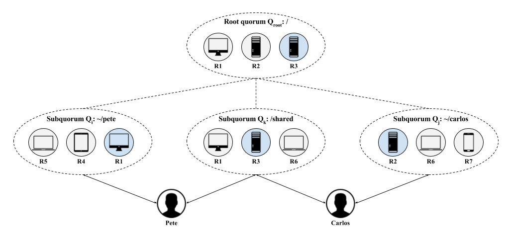

# Welcome to FluidFS

FluidFS is a personal, wide-area, distributed file system that provides better responsiveness and stronger consistency guarantees than prior systems. It supports multiple, sometimes-collaborating users each with multiple personal devices and computing nodes. Users are geographically distributed, potentially across continents and as a result FluidFS must be responsive to network conditions. To provide responsive strong consistency, FluidFS implements a novel form of distributed coordination called _hierarchical consensus_, currently being researched at the University of Maryland.

The goals of FluidFS are a system with the following characteristics:

- _fault tolerance_: robust to device failures and network partitions
- _flexibility_: able to add and remove devices through local subquorums
- _availability_: mobile users can access data when centralized storage is either unavailable or too slow
- _concurrency_: simultaneous access by multiple users enables both collaboration and use by users or projects that are unrelated
- _correctness_: data must be consistent to the limits of the storage model
- _durability_: data must be durable on the level of years, implying a platform-agnostic view of storage

Decentralized consensus algorithms are used by distributed systems to make global decisions that must be durable. FluidFS uses a variant of the [Raft consensus algorithm](https://raft.github.io/) called _hierarchical consensus_ to ensure small quorum sizes, high availability, and strong coordination across geographically distributed devices. Hierarchical consensus flexibly allocates subquorums to dynamic object groupings. This allows availability and performance due to the localization of quorum membership near to where accesses are occurring. It also allows larger quorums because the decision space is segmented across a large number of devices.

## Development

The primary interface is a command line program that interacts directly with the fluid library. Building from source is implemented using the included Makefile, which fetches dependencies and builds locally rather than to the `$GOPATH`:

    $ make

There is an RSpec-style test suite that uses [Ginkgo](https://github.com/onsi/ginkgo) and [Gomega](https://github.com/onsi/gomega). These tests can be run with the Makefile:

    $ make test

### Contributing

Note that labels in the Github issues are defined in the blog post: [How we use labels on GitHub Issues at Mediocre Laboratories](https://mediocre.com/forum/topics/how-we-use-labels-on-github-issues-at-mediocre-laboratories).

The repository is set up in a typical production/release/development cycle as described in _[A Successful Git Branching Model](http://nvie.com/posts/a-successful-git-branching-model/)_. A typical workflow is as follows:

1. Select a card from the [dev board][waffle_href] - preferably one that is "ready" then move it to "in-progress".

2. Create a branch off of develop called "feature-[feature name]", work and commit into that branch.

        ~$ git checkout -b feature-myfeature develop

3. Once you are done working (and everything is tested) merge your feature into develop.

        ~$ git checkout develop
        ~$ git merge --no-ff feature-myfeature
        ~$ git branch -d feature-myfeature
        ~$ git push origin develop

4. Repeat. Releases will be routinely pushed into master via release branches, then deployed to the server.

### Agile Board and Documentation

The development board can be found on Waffle:

> [https://waffle.io/bbengfort/fluidfs][waffle_href]

The documentation can be built and served locally with [mkdocs](http://www.mkdocs.org/):

    $ mkdocs serve

The latest version of the documentation is hosted with GitHub Pages and can be found at the project link:

> [https://bbengfort.github.io/fluidfs][docs]

To build and publish the documentation, use the make file:

    $ make publish

This will use the `mkdocs gh-deploy` command to build the site to the gh-pages branch and will push to origin.

[docs]: https://bbengfort.github.io/fluidfs/
[waffle_href]: https://waffle.io/bbengfort/fluidfs
